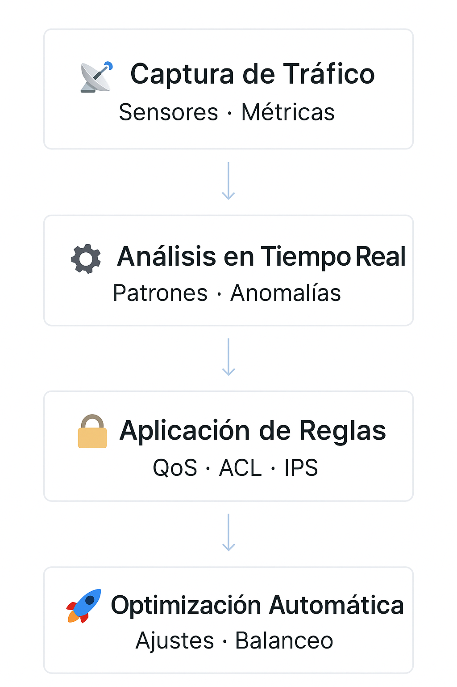

# 🚀 NetGuard Pro – Plataforma Empresarial de Optimización y Seguridad de Redes


---

# 📘 Descripción General

**NetGuard Pro**, desarrollado por **NetGuard Solutions**, es un software empresarial diseñado para optimizar, asegurar y escalar entornos de red modernos.

> Para más información la documentación extendida está disponible en:  : [Documentación Oficial Pública](https://docs.google.com/document/d/13Y2Jr68-xcsJxbS1nzUGuPG9umeYAFUy/edit)

Ofrece:

- Monitoreo en tiempo real  
- Gestión automatizada del tráfico  
- Módulos avanzados de seguridad  
- Integraciones empresariales  
- Escalabilidad horizontal para grandes infraestructuras  

Este README sirve como guía para desarrolladores, administradores de TI y equipos de soporte.

---

# 📂 Tabla de Contenidos

1. Características Principales  
2. Arquitectura del Sistema  
3. Requisitos Previos  
4. Instalación  
5. Configuración Inicial  
6. Uso del Sistema  
7. Integraciones Disponibles  
8. Solución de Problemas  
9. Buenas Prácticas  
10. Actualizaciones  
11. Soporte Técnico  
12. Licencia  

---

# ⭐ Características Principales

### 🔧 Optimización de Red
- Monitoreo en tiempo real  
- Asignación dinámica de ancho de banda  
- Detección de cuellos de botella  

### 🔐 Seguridad
- Firewall integrado  
- Detección de amenazas en tiempo real  
- Cifrado TLS 1.3  

### 📈 Escalabilidad
- Integración con AWS, Azure, GCP  
- Balanceo dinámico entre servidores  

### 🖥️ Interfaz & API
- Dashboard intuitivo  
- Vistas configurables  
- API REST  

---

# 🏗️ Arquitectura del Sistema

El flujo principal de procesamiento de NetGuard Pro es el siguiente:



## 📁 Estructura del Proyecto

La estructura del proyecto está organizada de forma modular para facilitar mantenimiento y contribución:

```text
/netguard-pro
 ├── core/               # Motor principal (NetGuard Engine)
 ├── ui/                 # Interfaz de usuario (Dashboard)
 ├── api/                # Endpoints REST
 ├── sensors/            # Captura de tráfico y colectores
 ├── security/           # Reglas, firewall interno, ACL, IPS
 ├── config/             # Archivos de configuración y plantillas
 ├── scripts/            # Herramientas de despliegue y pruebas
 ├── integrations/       # Módulos para Slack, PagerDuty, SIEM, etc.
 └── docs/               # Documentación técnica y guías
```

---

# 🧩 Requisitos Previos

### 💻 Sistemas Operativos:
- Windows Server 2016/2019  
- Ubuntu 20.04+, CentOS 7+  
- macOS 10.15+  

### Hardware:
| Recurso | Mínimo | Recomendado |
|--------|--------|-------------|
| CPU | Quad-core 2.5 GHz | Octa-core 3.0 GHz |
| RAM | 8 GB | 16 GB |
| Disco | 500 GB HDD | 1 TB SSD |
| Red | 1 Gbps | 10 Gbps |

---

# 📦 Instalación

## ▶️ Opción 1: Docker (Recomendada)

```bash
docker pull netguardsolutions/netguard-pro:latest
```

```bash
docker run -d   --name netguard-pro   -p 8080:8080   -v /etc/netguard:/config   netguardsolutions/netguard-pro:latest
```

---

## ▶️ Opción 2: Instalación Manual

```bash
sudo ./install.sh
```

```bash
systemctl enable netguard
systemctl start netguard
systemctl status netguard
```

---

# 🛠️ Configuración Inicial

1. Abrir: `http://<IP-servidor>:8080`  
2. Credenciales iniciales: **admin / netguard123**  
3. Cambiar contraseña inmediatamente  
4. Configurar:  
   - Interfaces de red  
   - Políticas de tráfico  
   - Alertas  
   - Integraciones  

---

# 💻 Uso del Sistema

### 🧑‍💻 Desarrolladores
- API  
- Integraciones  
- Logs  

### 🛠️ Administradores
- Seguridad  
- Configuración de red  
- Monitoreo  

### 🧯 Soporte Técnico
- Diagnóstico  
- Logs  
- Alertas  

---


# 🤝 Contribuciones (para desarrolladores)

Nos encanta colaborar. Para desarrolladores:

- Fork del repositorio.
- Crea una branch:
  ```
  feature/<tu-feature>
  ```
- Sigue reglas de estilo (PEP8 Python, ESLint JS).
- Ejecuta pruebas locales (`./scripts/run-tests.sh`).
- Abre Pull Request con descripción clara y pruebas.

### Requisitos para PRs
- Tests unitarios incluidos.
- Documentación actualizada si aplica.
- Revisión y aprobación de al menos 2 mantenedores.

---

# 🔗 Integraciones Disponibles

### Cloud:
- AWS  
- Azure  
- Google Cloud  

### Herramientas:
- Slack  
- PagerDuty  
- Splunk  

---

# 🛑 Solución de Problemas

| Problema | Acción |
|----------|--------|
| No inicia | `systemctl restart netguard` |
| No hay tráfico | Revisar SPAN/TAP |
| Fallo LDAP | Revisar puertos y sintaxis |
| CPU alta | Reducir frecuencia de muestreo |

---

# ⭐ Buenas Prácticas
- Activar HTTPS  
- Cambiar credenciales iniciales  
- Respaldar `/config`  
- Integrar SIEM  

---

# 🔄 Actualizaciones

```bash
docker pull netguardsolutions/netguard-pro:latest
docker stop netguard-pro
docker rm netguard-pro
docker run -d ... (misma configuración)
```

---

# 🆘 Soporte Técnico

📧 soporte@netguardsolutions.com  
🌐 https://www.netguardsolutions.com/support  
🕒 L–V | 09:00–18:00 UTC-6  

---

# 📄 Licencia

NetGuard Pro es software propietario bajo un modelo de suscripción. Consulta LICENSE.txt para más detalles.